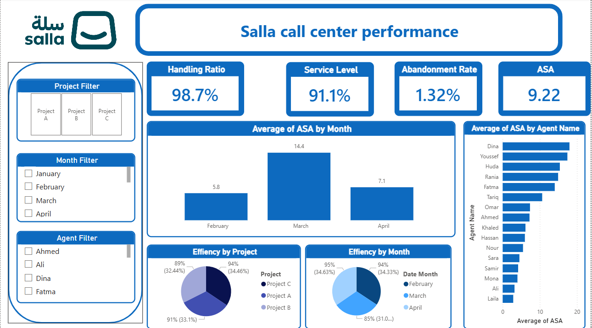

# Salla Call Center Performance Analysis

## Project Overview
This project features a Power BI dashboard designed to analyze and monitor the performance of a call center operating on the Salla platform. The dashboard provides real-time insights into operational efficiency, agent productivity, and service quality.

## Dashboard Preview

## Key Performance Indicators (KPIs)
The dashboard tracks four critical metrics to evaluate call center health:
* **Handling Ratio:** 98.7%
* **Service Level:** 91.1%
* **Abandonment Rate:** 1.32%
* **Average Speed of Answer (ASA):** 9.22

## Visualizations and Insights
* **Average of ASA by Month:** Analyzes response time trends across February ($5.8$), March ($14.4$), and April ($7.1$).
* **Average of ASA by Agent Name:** A ranked bar chart identifying individual agent performance, with Dina and Youssef showing the highest average ASA.
* **Efficiency by Project:** A pie chart breaking down performance across Project A ($91\%$), Project B ($89\%$), and Project C ($94\%$).
* **Efficiency by Month:** A donut chart showing monthly efficiency distributions for February ($95\%$), March ($94\%$), and April ($85\%$).

## Interactive Features
The report includes sidebar slicers to allow for deep-dive analysis:
* **Project Filter:** Toggle between different operational projects.
* **Month Filter:** Filter data by specific months (January - April).
* **Agent Filter:** View metrics for specific team members like Ahmed, Ali, Dina, and Fatma.

## How to Run the Project
1. Clone this repository to your local machine.
2. Ensure you have **Power BI Desktop** installed.
3. [cite_start]Open the `Salla Analysis Project.pbix` file[cite: 1].
4. Use the filters on the left panel to interact with the data.

---
*Created as part of the Salla Analysis Project.*
